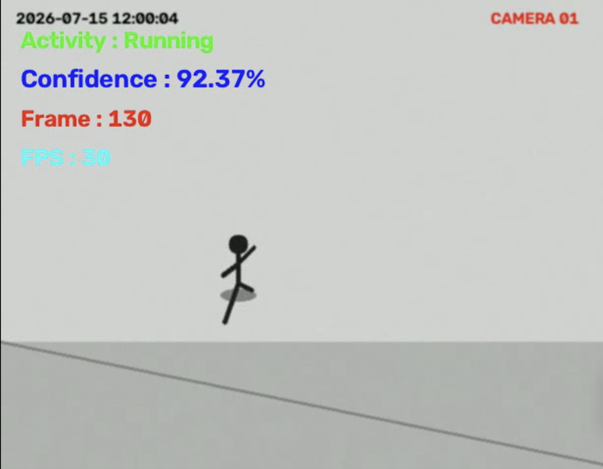

# 📹 CCTV Activity Recognition (Mini Project)

> A mini project that uses **OpenCV** for video/frame processing and a **TensorFlow/Keras CNN** to classify human activity — **Walking, Sitting, Running, and Fighting** — from CCTV-style video footage.

> **Note:** This is a **mini / academic project** built for learning purposes (dataset generation, OpenCV preprocessing, CNN training, and inference on video). It is **not** a production-grade surveillance system.

---

## 📌 Overview

This project simulates a simplified CCTV activity recognition pipeline:

1. A synthetic CCTV-style video is generated (since a real, labeled CCTV dataset wasn't used for this mini project).
2. Frames are extracted from the video using OpenCV.
3. Frames are preprocessed (resized, color-converted, normalized).
4. Frames are organized into a labeled `train`/`test` dataset folder structure.
5. A CNN is trained on the labeled frames to classify 4 activities.
6. The trained model is used to run predictions on video, producing an annotated output video and a CSV log of predictions.

---

## 🏗️ Pipeline Architecture

```
                        ┌───────────────────────────┐
                        │   video_generator.py      │
                        │  (Synthetic CCTV video)   │
                        └────────────┬──────────────┘
                                     │
                                     ▼
                        data/raw_video/cctv_video.mp4
                                     │
                                     ▼
                        ┌───────────────────────────┐
                        │   extract_frames.py       │
                        │  (OpenCV frame capture)   │
                        └────────────┬──────────────┘
                                     │
                                     ▼
                             data/frames/*.jpg
                                     │
                                     ▼
                        ┌───────────────────────────┐
                        │   preprocess.py           │
                        │  Resize (48x48)           │
                        │  BGR → RGB                │
                        │  Normalize (0-1)          │
                        └────────────┬──────────────┘
                                     │
                                     ▼
                          data/preprocessed/*.jpg
                                     │
                                     ▼
                        ┌───────────────────────────┐
                        │   dataset.py              │
                        │  Label frames by activity │
                        │  Split into train/test    │
                        └────────────┬──────────────┘
                                     │
                                     ▼
        data/dataset/{train,test}/{Walking,Sitting,Fighting,Running}/
                                     │
                                     ▼
                        ┌───────────────────────────┐
                        │   cnn_model.py            │
                        │  Conv2D → Pool → Conv2D    │
                        │  → Pool → Dense → Dropout │
                        │  → Softmax (4 classes)    │
                        └────────────┬──────────────┘
                                     │
                                     ▼
                        ┌───────────────────────────┐
                        │   train.py                │
                        │  Fit CNN on train/test    │
                        │  Save accuracy/loss plots │
                        └────────────┬──────────────┘
                                     │
                                     ▼
                      models/activity_model.keras
                                     │
                                     ▼
                        ┌───────────────────────────┐
                        │   predict.py              │
                        │  Read video frame-by-frame│
                        │  Predict activity + conf. │
                        │  Overlay text on frame    │
                        └────────────┬──────────────┘
                                     │
                                     ▼
           output/predicted_video.mp4  +  output/predictions.csv
```

---

## 📂 Project Structure

```
CCTV_Activity_Recognition_Mini_Project/
│
├── data/
│   ├── raw_video/          # Source CCTV-style video
│   ├── frames/             # Frames extracted from raw video
│   ├── preprocessed/       # Resized/normalized frames
│   └── dataset/            # Labeled train/test split (Walking, Sitting, Fighting, Running)
│
├── images/                 # Reference plots (accuracy/loss/sample output)
│
├── models/
│   └── activity_model.keras   # Trained CNN model
│
├── output/
│   ├── predicted_video.mp4     # Annotated output video
│   ├── predictions.csv         # Per-frame prediction log
│   ├── training_accuracy.png
│   └── training_loss.png
│
├── src/
│   ├── video_generator.py            # Generates the synthetic CCTV video
│   ├── extract_frames.py             # Extracts frames from the video
│   ├── preprocess.py                 # Resizes/normalizes frames
│   ├── dataset.py                    # Builds labeled train/test dataset
│   ├── cnn_model.py                  # CNN architecture definition
│   ├── train.py                      # Trains the CNN and saves the model
│   ├── predict.py                    # Runs inference on a video
│   └── video_generator(raw_video).py # Alternate/reference video generator script
│
├── requirements.txt
├── LICENSE
└── README.md
```

---

## 🧠 Model Architecture

| Layer                | Details                          |
|----------------------|-----------------------------------|
| Input                | 48 × 48 × 3                       |
| Conv2D               | 32 filters, 3×3, ReLU             |
| MaxPooling2D         | 2×2                                |
| Conv2D               | 64 filters, 3×3, ReLU             |
| MaxPooling2D         | 2×2                                |
| Flatten              | —                                   |
| Dense                | 128 units, ReLU                   |
| Dropout              | 0.5                                 |
| Dense (Output)       | 4 units, Softmax                  |

**Optimizer:** Adam &nbsp;|&nbsp; **Loss:** Categorical Crossentropy &nbsp;|&nbsp; **Classes:** Walking, Sitting, Fighting, Running

---

## ⚙️ Setup

```bash
# 1. Clone the repository
git clone https://github.com/sahilsharma20/CCTV_Activity_Recognition_Mini_Project.git
cd CCTV_Activity_Recognition_Mini_Project

# 2. Create a virtual environment (recommended)
python -m venv venv
source venv/bin/activate      # On Windows: venv\Scripts\activate

# 3. Install dependencies
pip install -r requirements.txt
```

---

## ▶️ Usage

Run the pipeline stages in order from the project root:

```bash
# 1. Generate the synthetic CCTV video (optional if data/raw_video already has a video)
python src/video_generator.py

# 2. Extract frames from the video
python src/extract_frames.py

# 3. Preprocess extracted frames
python src/preprocess.py

# 4. Build the labeled train/test dataset
python src/dataset.py

# 5. Train the CNN model
python src/train.py

# 6. Run predictions on a video
python src/predict.py
```

**Outputs:**
- Trained model → `models/activity_model.keras`
- Accuracy/loss plots → `output/training_accuracy.png`, `output/training_loss.png`
- Annotated prediction video → `output/predicted_video.mp4`
- Per-frame prediction log → `output/predictions.csv`

---

## 📊 Results

| Metric              | Value (sample run) |
|----------------------|--------------------|
| Training Accuracy    | See `output/training_accuracy.png` |
| Validation Accuracy  | See `output/training_accuracy.png` |
| Training Loss        | See `output/training_loss.png` |

Sample annotated output frame:



---

## 🛠️ Tech Stack

- **Python**
- **OpenCV** — video I/O, frame extraction, preprocessing, video annotation
- **TensorFlow / Keras** — CNN model definition, training, inference
- **NumPy / Matplotlib** — data handling and visualization
- **Scikit-learn** — supporting utilities

---

## ⚠️ Limitations (Mini Project Scope)

- The dataset is generated synthetically (stick-figure animations), not real CCTV footage — this project focuses on demonstrating the **end-to-end pipeline** (video → frames → preprocessing → CNN → inference), not production accuracy.
- Only 4 activity classes are supported.
- No object detection/tracking is used — the whole frame is classified rather than a detected person.

---

## 👤 Author

**Sahil Sharma**
GitHub: [@sahilsharma20](https://github.com/sahilsharma20)

---

## 📄 License

This project is licensed under the terms of the [LICENSE](LICENSE) file included in this repository.